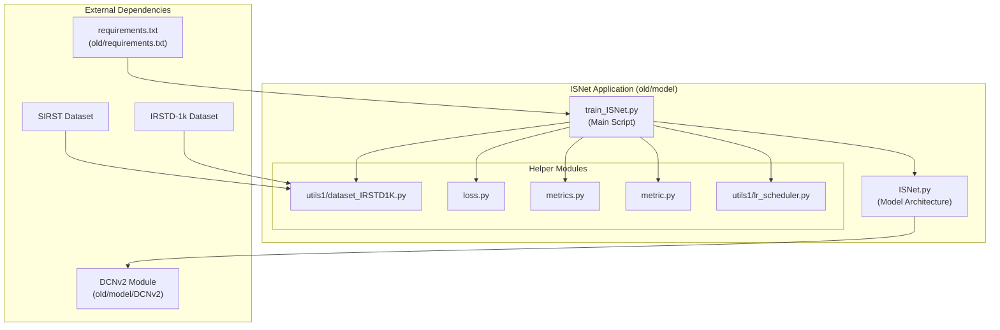

# ISNet Project Architecture

This document outlines the project architecture for ISNet based on the provided code and usage instructions.

## Step 1: Setup and Dependencies

1.  **Install Python Packages**:
    *   **File**: [old/requirements.txt](cci:7://file:///c:/shirosoralumie648/ISNET-on-jitter/old/requirements.txt:0:0-0:0)
    *   **Action**: Contains a list of Python dependencies that need to be installed using pip.
    ```bash
    pip install -r old/requirements.txt
    ```

2.  **Download Datasets**:
    *   **IRSTD-1k**:
        *   **Action**: Download and place the dataset in `./IRSTD-1k`.
        *   **Usage**: Likely used by `old/model/utils1/dataset_IRSTD1K.py`.
    *   **sirst**:
        *   **Action**: Download and place the dataset in `./sirst-master`.
        *   **Usage**: Likely used by `old/model/utils1/dataset_IRSTD1K.py`.

## Step 2: Core Model and Training

1.  **Install DCNv2 (Deformable Convolutional Networks v2)**:
    *   **Source**: `https://github.com/jinfagang/DCNv2_latest`
    *   **Action**:
        1.  Install DCNv2 according to its repository instructions.
        2.  Place the compiled DCNv2 module into `old/model/DCNv2/`.
        3.  Compile DCNv2.
    *   **Usage**: The [train_ISNet.py](cci:7://file:///c:/shirosoralumie648/ISNET-on-jitter/old/model/train_ISNet.py:0:0-0:0) script or the [ISNet.py](cci:7://file:///c:/shirosoralumie648/ISNET-on-jitter/old/model/ISNet.py:0:0-0:0) model will likely import and use components from this module.

2.  **Training Script**: [old/model/train_ISNet.py](cci:7://file:///c:/shirosoralumie648/ISNET-on-jitter/old/model/train_ISNet.py:0:0-0:0)
    *   **Purpose**: This is the main script to train the ISNet model.
    *   **Key functionalities**:
        *   Parses command-line arguments for training configuration (e.g., batch size, epochs, learning rate, model parameters).
        *   Initializes the dataset loaders using `SirstDataset` from `old/model/utils1/dataset_IRSTD1K.py`.
        *   Initializes the ISNet model defined in [old/model/ISNet.py](cci:7://file:///c:/shirosoralumie648/ISNET-on-jitter/old/model/ISNet.py:0:0-0:0).
        *   Defines and uses loss functions:
            *   `SoftLoULoss1`, `SoftLoULoss` from [old/model/loss.py](cci:7://file:///c:/shirosoralumie648/ISNET-on-jitter/old/model/loss.py:0:0-0:0).
            *   `nn.BCELoss` from PyTorch.
        *   Sets up the optimizer (e.g., Adagrad) and learning rate scheduler (`adjust_learning_rate` from `old/model/utils1/lr_scheduler.py`).
        *   Implements the training loop: iterates through epochs and batches, performs forward and backward passes, and updates model weights.
        *   Implements the validation loop: evaluates the model on the validation set.
        *   Calculates and logs various metrics:
            *   `SigmoidMetric`, `SamplewiseSigmoidMetric` from [old/model/metrics.py](cci:7://file:///c:/shirosoralumie648/ISNET-on-jitter/old/model/metrics.py:0:0-0:0).
            *   `PD_FA`, `ROCMetric`, `mIoU` from [old/model/metric.py](cci:7://file:///c:/shirosoralumie648/ISNET-on-jitter/old/model/metric.py:0:0-0:0).
        *   Saves model checkpoints and training logs (e.g., using TensorBoardX).
        *   Includes helper classes for gradient computation ([Get_gradient_nopadding](cci:2://file:///c:/shirosoralumie648/ISNET-on-jitter/old/model/train_ISNet.py:287:0-319:16), [Get_gradientmask_nopadding](cci:2://file:///c:/shirosoralumie648/ISNET-on-jitter/old/model/train_ISNet.py:320:0-341:17)) defined within the script itself.

## Core Modules Used by [train_ISNet.py](cci:7://file:///c:/shirosoralumie648/ISNET-on-jitter/old/model/train_ISNet.py:0:0-0:0):

*   **Model Definition**:
    *   [old/model/ISNet.py](cci:7://file:///c:/shirosoralumie648/ISNET-on-jitter/old/model/ISNet.py:0:0-0:0): Contains the neural network architecture for ISNet.
*   **Dataset Handling**:
    *   `old/model/utils1/dataset_IRSTD1K.py`: Defines `SirstDataset` class for loading and preprocessing data from the IRSTD-1k and potentially sirst datasets.
*   **Loss Functions**:
    *   [old/model/loss.py](cci:7://file:///c:/shirosoralumie648/ISNET-on-jitter/old/model/loss.py:0:0-0:0): Implements custom loss functions like `SoftLoULoss1` and `SoftLoULoss`.
*   **Evaluation Metrics**:
    *   [old/model/metrics.py](cci:7://file:///c:/shirosoralumie648/ISNET-on-jitter/old/model/metrics.py:0:0-0:0): Provides metrics such as `SigmoidMetric` and `SamplewiseSigmoidMetric`.
    *   [old/model/metric.py](cci:7://file:///c:/shirosoralumie648/ISNET-on-jitter/old/model/metric.py:0:0-0:0): Provides additional metrics like `PD_FA`, `ROCMetric`, and `mIoU`.
*   **Learning Rate Scheduler**:
    *   `old/model/utils1/lr_scheduler.py`: Contains the `adjust_learning_rate` function.
*   **External Compiled Module**:
    *   `old/model/DCNv2/`: Directory where the compiled DCNv2 module is expected.

## Ignored Files/Modules (based on [train_ISNet.py](cci:7://file:///c:/shirosoralumie648/ISNET-on-jitter/old/model/train_ISNet.py:0:0-0:0) imports):

*   [old/model/config.py](cci:7://file:///c:/shirosoralumie648/ISNET-on-jitter/old/model/config.py:0:0-0:0): Does not appear to be directly imported by [train_ISNet.py](cci:7://file:///c:/shirosoralumie648/ISNET-on-jitter/old/model/train_ISNet.py:0:0-0:0). Configuration seems to be handled by argument parsing.
*   [old/model/loss1.py](cci:7://file:///c:/shirosoralumie648/ISNET-on-jitter/old/model/loss1.py:0:0-0:0): Not imported by [train_ISNet.py](cci:7://file:///c:/shirosoralumie648/ISNET-on-jitter/old/model/train_ISNet.py:0:0-0:0) (which imports [loss.py](cci:7://file:///c:/shirosoralumie648/ISNET-on-jitter/old/model/loss.py:0:0-0:0)).
*   [old/model/testmodule.py](cci:7://file:///c:/shirosoralumie648/ISNET-on-jitter/old/model/testmodule.py:0:0-0:0): Likely a test script, not part of the main training pipeline.
*   `old/model/lib/`, `old/model/my_functionals/`, `old/model/network/`, `old/model/sync_batchnorm/`, `old/model/utils/`: These directories and their contents are not directly imported by [train_ISNet.py](cci:7://file:///c:/shirosoralumie648/ISNET-on-jitter/old/model/train_ISNet.py:0:0-0:0). They might be dependencies of [ISNet.py](cci:7://file:///c:/shirosoralumie648/ISNET-on-jitter/old/model/ISNet.py:0:0-0:0) or other imported modules, or remnants of older code. A deeper analysis of [ISNet.py](cci:7://file:///c:/shirosoralumie648/ISNET-on-jitter/old/model/ISNet.py:0:0-0:0) would be needed to confirm their usage.

## Project Architecture Diagram



This architecture is derived from the provided usage steps and an analysis of the import statements in [old/model/train_ISNet.py](cci:7://file:///c:/shirosoralumie648/ISNET-on-jitter/old/model/train_ISNet.py:0:0-0:0).